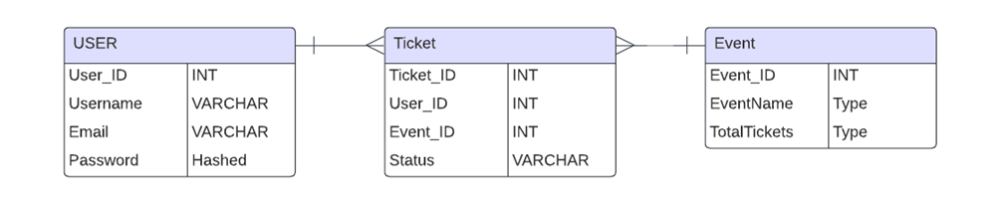

## What this project about?
This project is my laboratory work for university.  
In this repository I am going to track my success of writing Back-end on Flask.

## How to start up this project?
To start this project you should
1. In config file and alembic init write your database url
2. Download all of the packages with <code>pip install -r requirements.txt</code>
3. Make a database migration with <code>alembic revision --autogenerate -m "init"</code>
4. Upgrade database <code>alembic upgrade head</code>
5. Run the project with <code>flask run</code>
6. Optional. If you want to run tests write <code>pytest test/test.py</code>
7. Optional. To use swagger go to localhost:5000/api/docs

## Short description of a project.
My task was to create a service for a booking tickets
  I created an ERD with 3 entities in it:

I used python(flask) and vanilla javascript.
